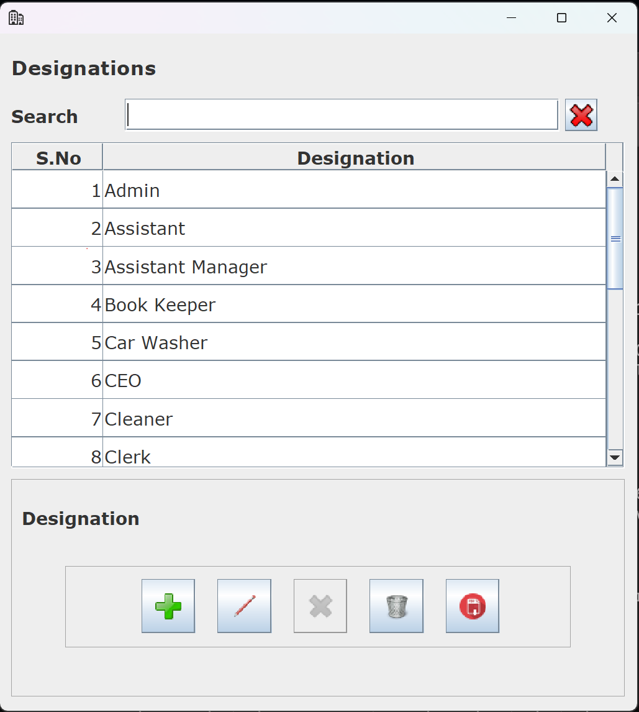
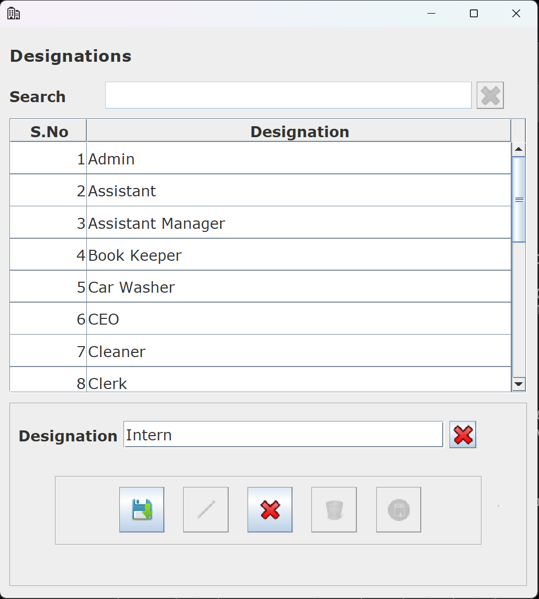
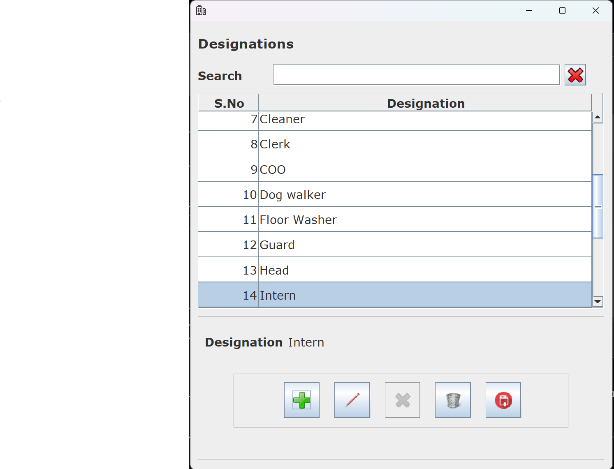
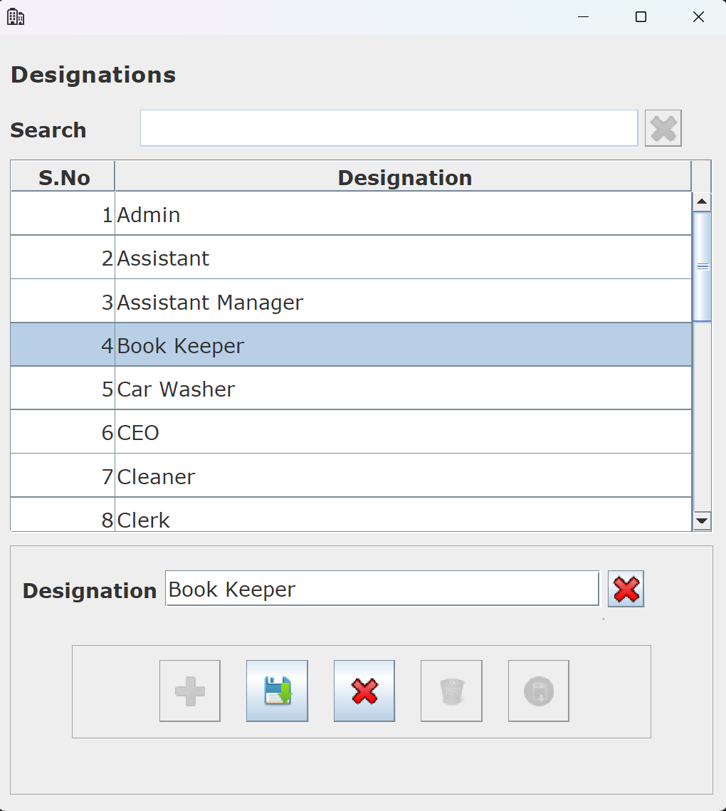
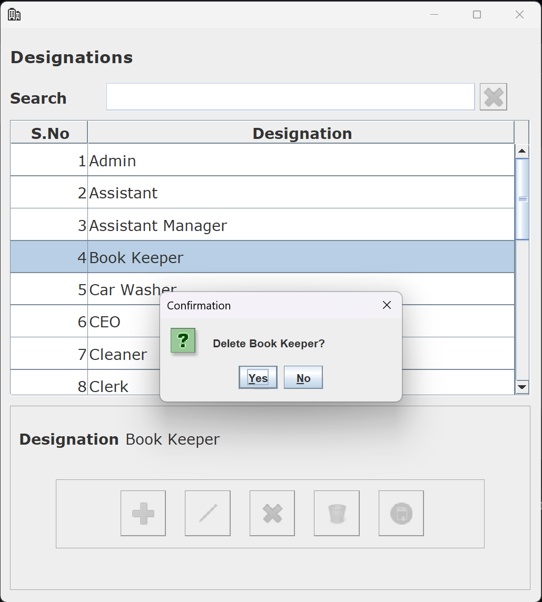
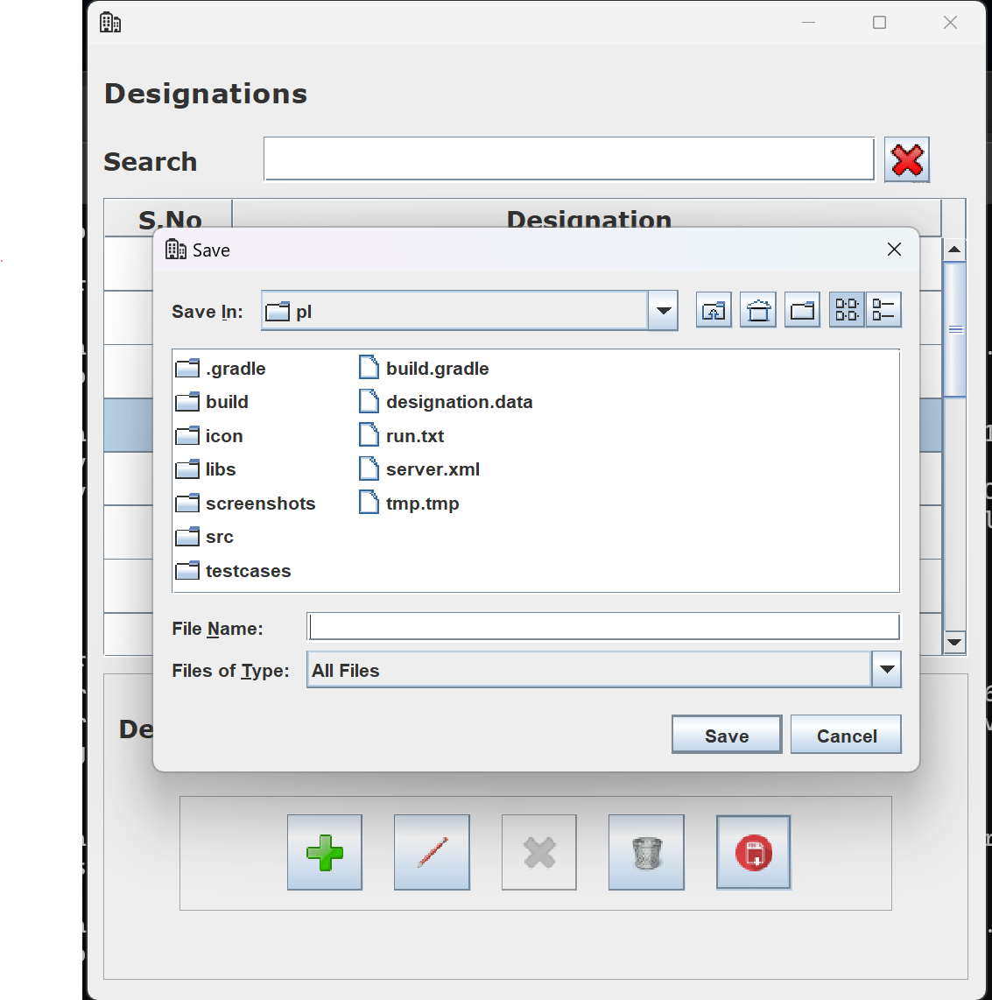
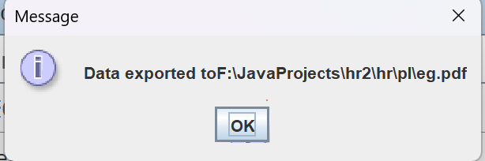

# HR Management Application
## (As of right now, it's an ongoing project. The Employee Module is being worked on, and the Designation Module is complete as of right now.)

The HR Management Application is a comprehensive Java Swing-based solution for efficient Human Resource management within organizations. It is structured with three essential layers: Presentation Layer, Business Layer, and Data Layer, allowing flexibility in data storage through File Handling or an SQL Database. Additionally, it includes a Network Layer for facilitating communication across a network, enabling multiple users to perform CRUD operations on Employee and Designation databases simultaneously.

## Introduction
The HR Management Application simplifies HR tasks and processes by offering a user-friendly graphical interface built using Java Swing. Users can seamlessly perform CRUD operations, including Create, Read, Update, and Delete, on both Employee and Designation databases. Its modular architecture allows for flexibility and scalability, making it a valuable asset for HR departments in various organizations.

## Key Features
- User-Friendly GUI: The application's graphical user interface, created with Java Swing, provides an intuitive and responsive experience for users.

- CRUD Operations: Seamlessly manage employee and designation data by performing CRUD operations through the application.

- Modular Architecture: The layered architecture divides the application into Presentation, Business, Data, and Network layers, simplifying maintenance and enhancing extensibility.

- Data Storage Flexibility: Choose between File Handling or an SQL Database as your preferred data storage solution, depending on your organization's requirements.

- Network Communication: The Network Layer facilitates communication across a network, enabling multiple users to access and interact with the application simultaneously.

- Export to PDF:- You can easily export the database to PDF(Currently only works for designations).

## Application Layers
The HR Management Application is structured into the following layers:

- Presentation Layer: The user interacts with the application through this layer, built using Java Swing, ensuring a user-friendly and responsive experience.

- Business Layer: This layer houses the core application logic, handling CRUD operations and other HR-related functionalities. A Proxy Business Layer enhances security and control.

- Data Layer: The Data Layer is responsible for data storage and retrieval. You can choose between File Handling or an SQL Database for data storage, adapting the application to meet your organization's specific needs.

- Network Layer: The Network Layer enables network communication, allowing multiple users to access the application concurrently.

## Data Storage Options
The Data Layer offers two data storage options:

- File Handling: Opt for this option to use files for data storage, which is lightweight and suitable for small to medium-sized organizations.

- SQL Database: Select an SQL database as the data storage solution for robust and scalable storage, ideal for organizations with extensive HR data requirements.

## Usage
To get started with the HR Management Application, follow these steps:

1. Clone this repository to your local machine or download the source code.

2. Make sure to download itext7 and mysql library.

3. Configure your preferred data storage option by setting up the appropriate data source (File Handling or SQL Database).
    - To use File handling, include dl in your classpath.
      - *designation.data* will be created when you add your first designation through the application(Custom file is not recommended).
    - To use SQL database, include dbdl in your classpath.
        - Make sure to create appropriate tables for Designations and Employee.
        - I have created the Designation table as :-
             - code int primary key auto_increment,
             - title char(35) not null unique
        - The Employee table is as follows:-
            - employee_id int primary key auto_increment,
            - name char(35) not null,
            - designation_code int not null,
            - date_of_birth date not null,
            - basic_salary decimal(12,2) not null,
            - gender char(1) not null,
            - is_indian boolean not null,
            - pan_number char(20) not null unique,
            - aadhar_card_number char(20) not null unique,
            - foreign key (designation_code) references designation(code)
    - If you wish to change any of the above tables according to your own preferences, make sure to study the code properly and change it accordingly. You will have to change the POJOs and DTO files if you make any changes to the tables.
    - *insert self-promotion* You can use the SetterGetterGenerator repo of mine if you decide that you need new POJOs and DTOs, it will surely make your work easier.
    - Check DAOConnection.java in *dbdl\src\main\java\com\rw\machines\hr\dl\dao* and make changes according to your database.

4. If you don't want to use the network module, just run the app from CMD in the *pl* directory with the following command:-
   
   ```
   java -classpath ..\common\dist\hr-common.jar;..\dbdl\build\libs\dbdl.jar;..\bl\build\libs\bl.jar;build\libs\pl.jar;libs\*;..\mysqljar\*;. com.rw.machines.hr.pl.Main

   ```
5. If you want to use the network module:-
   - First start the hrServer, use the command mentioned in hrserver\run.txt.
   - Then in pl directory, use the command mentioned in pl\run.txt.
   - Currently network module uses a proxy business layer. In future I plan to eliminate this extra step and use my own NetFramework(currently a prototype, will link the repo in near future) for this app.

6. If you want to change client configuration, make changes to *pl/server.xml*.

7. If you want to change server configuration, make changes to *hrserver/server.xml*.

8. If you wish to change the PDF format, you will have to make changes in  *exportToPDF()* inside *DesignationModel.java* in *pl\src\main\java\com\rw\machines\hr\pl\model*.

## Example


Suppose you have configured the application to use an SQL Database for data storage. You can use the GUI to:
- Add new employees and designations.
      - 
      - 
  
- View and edit employee and designation details.
      - 
  
- Delete employees and designations when necessary.
      - 
  
- Export data to PDF
      - 
      - 
  
  - You can check an example of the exported pdf [here](pl/eg.pdf).
    
- All changes will be seamlessly reflected in the SQL database.

## Contributing
I welcome contributions to the HR Management Application. If you have ideas for improvements, bug fixes, or new features, please open an issue or create a pull request on the [repository](https://github.com/RogueWarrior34/HRManagementApp).

## Contact
For any questions, feedback, or inquiries, please reach out to [Rogue](mailto:adityade343@gmail.com).

## License
The HR Management Application is open-source software released under the MIT License. You are free to use, modify, and distribute it according to the terms specified in the [license](https://github.com/RogueWarrior34/HRManagementApp/blob/main/LICENSE).


